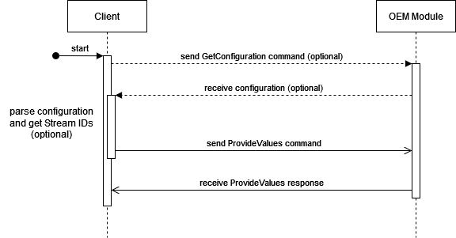

# tributech-oem-module-api

Tributech OEM Module API is a C library to use the OEM Module UART API in a simpler way.

# Communication flow - sequence diagramm



# API

## compatibility

| Version | OEM V1.3 | OEM V2.0 |
| ----------- | ----------- | ----------- |
| API V1.0 | yes | yes |

## get configuration
To receive the oem module configuration with all streams you have to build the GetConfiguration command.
```C
int build_get_configuration(char * result, char * transaction_id);
```
* The parameter 'result' is the build string  which must be send to the oem module via uart.
* The parameter 'transaction_id' is the transaction id.
* The return value is '1' if success or '0' if the transaction_id is wrong.

## provide values
To send a stream value to the oem module you have to build the provideValues command.
```C
int build_provide_values(char * result, char * transaction_id, char * id, char * data, char * timestamp);
```
* The parameter 'result' is the build string which must be send to the oem module via uart.
* The parameter 'transaction_id' is the transaction id.
* The parameter 'id' is the valueMetaDataId of the stream (Stream ID).
* The parameter 'data' is the BASE64 encoded string of the value.
* The parameter 'timestamp' is the timestamp. If '0' then the oem module uses it's own actual time.
* The return value is '1' if success or '0' if the timestamp is wrong.

## parse and save received configuration
To save the configuration you have to execute this function for parsing and saving the configuration from the response.
Use this function if you want to use the 'get_valueMetaDataId' function, otherwise you don't need it.
```C
uint8_t parse_oem_response_save_configuration(char * data, uint16_t cmd_len);
```
* The parameter 'data' is the response of the oem module.
* The parameter 'cmd_len' is the length of the response message.
* The return value is '1' if success or '0' if error.

## parse and save received configuration
This function searches in the saved configuration for the stream name and returns the stream id.
```C
uint8_t get_valueMetaDataId(char * stream_name, char * id);
```
* The parameter 'stream_name' is the name of the stream.
* The parameter 'id' is the valueMetaDataId of the stream.
* The return value is '1' if success or '0' if error.

## increase the transaction number
This functions increases the 'transaction_nr_dec' by one and converts it to string 'transaction_nr_string'.
```C
void increase_transaction_nr(void);
```

## lowercase and uppercase string
These functions convert uppercase letters to lowercase and lowercase letters to uppercase.
```C
char * to_lower_case(char * text);
char * to_upper_case(char * text);
```
* The parameter 'text' is the response of the oem module.
* Returns the result string.

## minimum of two values
This function gets the minium value of the two input values.
```C
uint32_t min2_uint32_t (uint32_t value1, uint32_t value2);
```
* The parameters 'value1' and 'value2' are the values which will be compared.
* Returns the minimum value of the two.

## example without parsing the configuration
This example code sends every 10 seconds the temperature value to the oem module.
```C
#include "base64.h"
#include "tributech_oem_api.h"

int main(void)
{
	time_t last_command_sent;

	char *base64_string;      			// pointer to base64 string
	char *provide_values_message;		// provide values output message
	float temperature = 15.5;			// temperature value
	
	while(1U)
	{
		//++++++++++++++++++++++++++++++++++++++++++++++++++++
		// publish values every 10 seconds
		if(last_command_sent + 10 < get_time())
		{
			//++++++++++++++++++++++++++++++++++++++++++++++++++++
			// increase transaction number
			increase_transaction_nr();

			//++++++++++++++++++++++++++++++++++++++++++++++++++++
			// build base64 string from value
			base64_string = calloc(20,sizeof(char));
			bintob64(base64_string,&temperature, sizeof(float));
			
			//++++++++++++++++++++++++++++++++++++++++++++++++++++
			// build ProvideValues command
			provide_values_message = calloc(200,sizeof(char));
			build_provide_values(provide_values_message,transaction_nr_string,"3b619323-7a61-465b-88df-24297efd5dda",base64_string,"0");

			//++++++++++++++++++++++++++++++++++++++++++++++++++++
			// send command via uart
			uart_output(&UART_OEM,provide_values_message);

			//++++++++++++++++++++++++++++++++++++++++++++++++++++
			// release memory
			delay_ms(100);
			free(base64_string);
			free(provide_values_message);

			//++++++++++++++++++++++++++++++++++++++++++++++++++++
			// save timestamp
			last_command_sent = get_time();
		}
	  }
	}
}
```

## example with parsing the configuration for stream ids
This example code sends every 10 seconds the temperature or pressure value to the oem module.
```C
#include "base64.h"
#include "tributech_oem_api.h"

int main(void)
{
	time_t last_command_sent;
	bool stream_ids_received;
	bool new_uart_receive;
	char valuemetadataid_temperature[37] = "";	// ValueMetaDataId 1
	char valuemetadataid_pressure[37] = "";		// ValueMetaDataId 2

	char *base64_string;      			// pointer to base64 string
	char *provide_values_message;		// provide values output message
	char send_message[50] = "";			// getConfiguration message
	float temperature = 15.5;
	float pressure = 1561;
	bool send_temperature_next = true;
	
	while(1U)
	{
		//++++++++++++++++++++++++++++++++++++++++++++++++++++
		// if no configuration received -> send getConfiguration command
		if (!configuration_received)
		{
			if (last_command_sent + 10 < get_time())
			{
				build_get_configuration(send_message,"1");		// generate getConfiguration command
				uart_output(&UART_OEM,send_message);			// send to uart
				get_config_transactionnr = 1;					// save getConfiguration transaction number
				last_command_sent = get_time();
			}
		}
		//++++++++++++++++++++++++++++++++++++++++++++++++++++
		// configuration received -> parse ids
		else if (configuration_received && !stream_ids_received)
		{
			get_valueMetaDataId("Temperature", valuemetadataid_temperature);
			get_valueMetaDataId("Pressure", valuemetadataid_pressure);

			if(strcmp(valuemetadataid_temperature,"") != 0 && strcmp(valuemetadataid_pressure,"") != 0)
			{
				stream_ids_received = true;
			}
		}
		//++++++++++++++++++++++++++++++++++++++++++++++++++++
		// ids received -> publish values every 10 seconds
		else if(last_command_sent + 10 < get_time() && stream_ids_received)
		{
			//++++++++++++++++++++++++++++++++++++++++++++++++++++
			// increase transaction number
			increase_transaction_nr();

			//++++++++++++++++++++++++++++++++++++++++++++++++++++
			// alloc base64 string and provideValues string in memory
			base64_string = calloc(20,sizeof(char));
			provide_values_message = calloc(200,sizeof(char));
			
			//++++++++++++++++++++++++++++++++++++++++++++++++++++
			// send temperature or pressure
			if (send_temperature_next)
			{
				bintob64(base64_string,&temperature, sizeof(float));
			
				build_provide_values(provide_values_message,transaction_nr_string,valuemetadataid_temperature,base64_string,"0");

				send_temperature_next = false;
			}
			else
			{
				bintob64(base64_string,&pressure, sizeof(float));
				
				build_provide_values(provide_values_message,transaction_nr_string,valuemetadataid_pressure,base64_string,"0");

				send_temperature_next = true;
			}

			//++++++++++++++++++++++++++++++++++++++++++++++++++++
			// send command via uart
			uart_output(&UART_OEM,provide_values_message);

			//++++++++++++++++++++++++++++++++++++++++++++++++++++
			// release memory
			delay_ms(100);
			free(base64_string);
			free(provide_values_message);

			//++++++++++++++++++++++++++++++++++++++++++++++++++++
			// save timestamp
			last_command_sent = get_time();
		}

		//+++++++++++++++++++++++++++++++++++++++++++++++++++++++++++++++++++++++++++++
		// uart receive
		if (new_uart_receive == true)
		{
			//++++++++++++++++++++++++++++++++++++++++++++++++++++++++++
			// parse oem response and save configuration
			parse_oem_response_save_configuration(uart_buffer, strlen(uart_buffer));

			//+++++++++++++++++++++++++++++++++++++++++++++++++++++++++++++
			// reset uart receive buffer
			memset(uart_buffer,0x0,UART_RECEIVE_BUFFER_SIZE);

			new_uart_receive = false;
		}
	}
}
```
## Base boards example projects
Base boards:

- [Nordic nRF52840-DK](https://github.com/tributech-solutions/tributech-oem-module-iot-kit-examples/tree/main/examble-nordic-nRF52840)
- [Infineon XMC4700 Relax Kit](https://github.com/tributech-solutions/tributech-oem-module-iot-kit-examples/tree/main/example-infineon-xmc4700)
- [Arduino UNO R3](https://github.com/tributech-solutions/tributech-oem-module-iot-kit-examples/tree/main/example-arduino-unoR3)

For further information about the Tributech OEM module please visite our documentation page [docs.tributech.io](https://docs.tributech.io/oem_module/overview).

				  